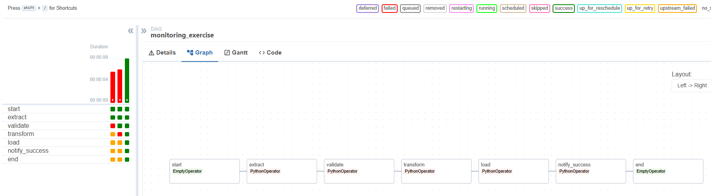

Broken Dag, ModuleNotFoundError, randoms is not a module
Fixed by changing module name to random

RUN

Validate fails with "ValueError: No data to validate", caused by bug 3
Fixed the bug by changing != to ==

RERUN

Transform fails with KeyError: 'amount', caused by bug 2 and 4.
Fixed by correcting "ammount" to "amount" in extract_data.

RERUN

DAG complete successfully

ALL dag runs
