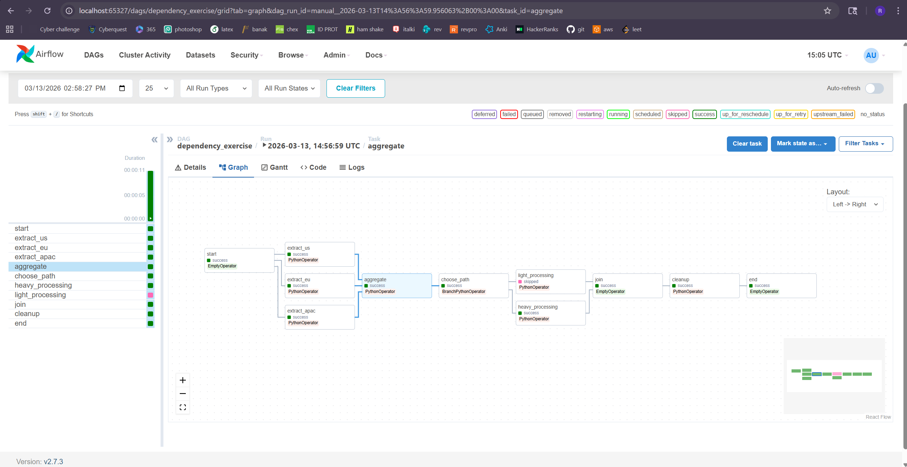
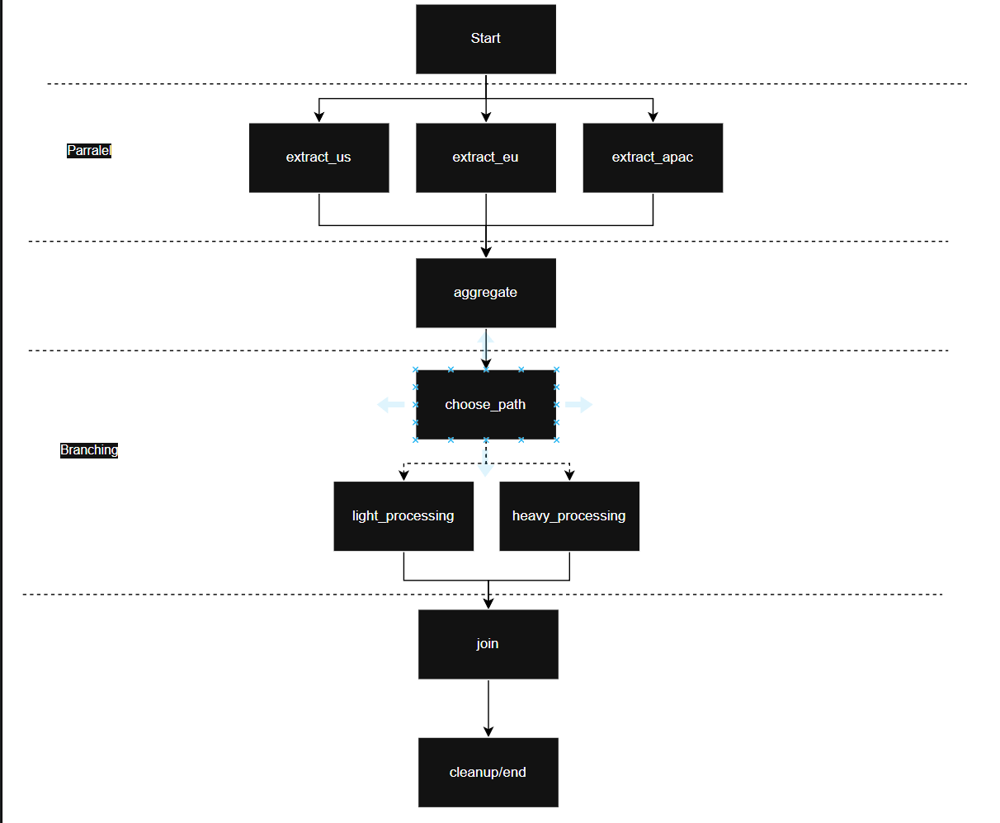

TASK 2:
2. 
The three extract tasks show paralel execution in the graph.

Aggregate waited untill all where finished due to its trigger rule "all_success".

Heavy was taken, light has the status "skipped"

Cleanup runs regardless of parent status (complete,fail or skipped) due to its trigger rule "all_done"

3. 

The extraction tasks are running in parralel
Light and heavy appear to be parralel but choose_path will only ever run one or the other

TASK 3:
3. 
The aggregate task was skipped since all the extractions must succeed.
The cleanup does still run since all the tasks finished even if they did not succeed.
Skipped tasks are orange for upstream_failed

TASK 4:
