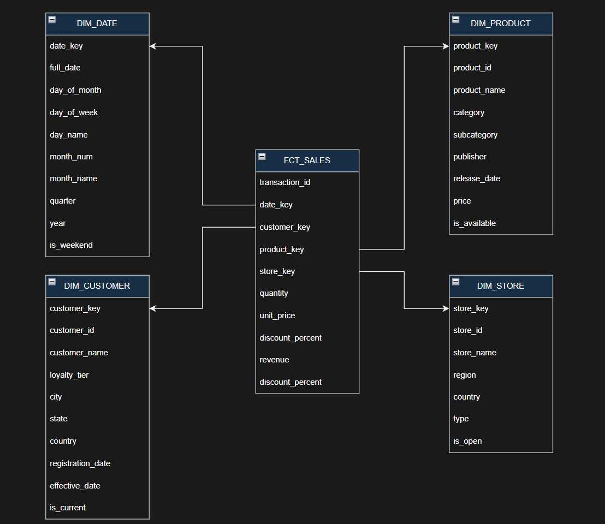

TASK 1:
1. How do sales perform across different regions?
Which product categories are perfoming well and which are performing poorly?
What kinds of products do our customers purchases, how much, when, and where do they purchase them?

2. Each row represents one transaction/sale.

3. Quantifiable information directly related to the sale. 
quantity, recenue and discount_amount go in fact table, everyhting else in a dimension table

TASK 2:

